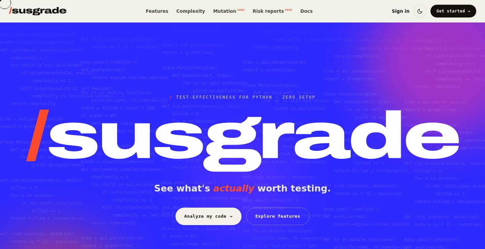

<div align="center">

# /susgrade

### See what's *actually* worth testing.

**susgrade** is a test-effectiveness analysis tool for Python. It brings together **structural complexity** and **test quality** into a single, plain-language risk report — so you always know where your testing effort will pay off next.

[](https://www.python.org/)
[](https://fastapi.tiangolo.com/)
[](https://docs.pydantic.dev/)
[](https://github.com/CodemasterAman/SUSGRADE/actions/workflows/ci.yml)


</div>



---

## Table of Contents

- [Why susgrade](#why-susgrade)
- [The Core Idea](#the-core-idea)
- [Features](#features)
- [Architecture](#architecture)
- [Tech Stack](#tech-stack)
- [Getting Started](#getting-started)
- [Using the Analyzer](#using-the-analyzer)
- [API Reference](#api-reference)
- [How the Complexity Engine Works](#how-the-complexity-engine-works)
- [Testing & Validation](#testing--validation)
- [Continuous Integration](#continuous-integration)
- [Roadmap & Vision](#roadmap--vision)
- [The Frontend](#the-frontend)
- [Team](#team)
- [Acknowledgments](#acknowledgments)
- [License](#license)

---

## Why susgrade

Writing tests is easy. Knowing *which* code deserves them is hard — especially for developers early in their careers.

Two questions decide where testing effort actually pays off:

1. **Where is the risk?** Complex, branch-heavy functions have many execution paths, and every path is a place a bug can hide.
2. **Is that risk actually tested?** Line coverage tells you a line *ran* — not that a test would *catch a bug* in it.

Most tools answer these questions separately. Coverage reports show what executed; complexity tools show what's tangled. Neither points you to the overlap — **the code that is both complex *and* weakly tested**. That overlap is exactly where real bugs survive.

susgrade exists to surface that overlap, and to make it approachable enough that a single developer with limited testing experience can act on it without a dedicated QA background. The metrics stay standard and defensible; the presentation stays human.

---

## The Core Idea

susgrade is built on two established, well-understood software-quality signals.

### 1. Cyclomatic Complexity — *how much there is to test*

Cyclomatic complexity (McCabe, 1976) measures the number of linearly independent paths through a function. In practice, it is the number of decision points plus one. A function with a complexity of `1` is a straight line; a function with a complexity of `20` has twenty independent ways to flow through it — twenty behaviours a thorough test suite has to account for. Higher complexity means more places for defects to hide and more effort required to test responsibly.

### 2. Mutation Score — *how good the tests actually are*

Mutation testing deliberately introduces small faults ("mutants") into the code — flipping a `>` to `>=`, a `+` to `-`, a `True` to `False` — and re-runs the existing test suite against each variant. If a test fails, it "killed" the mutant (good — the tests would have caught that bug). If every test still passes, a real defect just slipped through undetected. The **mutation score** is the fraction of mutants killed, and it measures test *effectiveness* in a way that line coverage never can.

> susgrade now ships a working mutation engine — operators for arithmetic, relational, logical, unary, boolean-constant and numeric-constant changes — exposed through both the API and the web UI. It also **fuses** complexity and mutation score into a single ranked risk report, so one number tells you which function to test next.

### Fusing them into one signal

Complexity tells you how much *could* go wrong. Mutation score tells you how much your tests would actually *catch*. susgrade's guiding formula combines the two:

```
risk = complexity × (1 − mutation_score)
```

A function that is **complex and poorly tested** rises to the top of the list. A trivial function — or a complex one that is already well tested — sinks to the bottom. The output is a ranked, plain-language answer to one question: **what should I test next?**

---

## Features

| | Capability | Status |
|:---:|---|:---:|
| ✅ | **Cyclomatic complexity engine** — per-function McCabe complexity computed from Python's `ast` | **Implemented** |
| ✅ | **Risk banding** — every function classified from *simple* to *very complex* | **Implemented** |
| ✅ | **REST API** — `POST /analyze/complexity`, `POST /analyze/mutation`, `GET /health`, built on FastAPI + Pydantic | **Implemented** |
| ✅ | **Interactive web UI** — live in-browser analyzer, ready-made sample snippets, light/dark theme, fully responsive | **Implemented** |
| ✅ | **Validated metrics** — 23 unit tests across the complexity and mutation engines, cross-checked against `radon` | **Implemented** |
| ✅ | **Mutation-testing engine** — inject mutants, run your suite against each, and score kills vs. survivors | **Implemented** |
| ✅ | **Interactive mutation UI** — paste code and tests, run against the backend, see the score and every surviving mutant | **Implemented** |
| ✅ | **Fused risk report** — ranks every function by `complexity × (1 − mutation score)` so you know what to test next | **Implemented** |
| ✅ | **Multi-language complexity** — **12 languages** live: Python, JavaScript, Java, C, C++, Go, Rust, C#, TypeScript, PHP, Kotlin, Swift (exact cyclomatic complexity, each via a real parser) | **Live** |
| ✅ | **CI integration** — a `susgrade` CLI with complexity, mutation and risk gates (each wired to an exit code), a ready-to-run GitHub Actions workflow, and an in-browser config generator | **Live** |
| ✅ | **Batch & repo scan** — drop a folder of source files, or point it at a public GitHub repo, and get a ranked cross-file complexity report over every function (all 12 languages, 100% in-browser via the GitHub API and raw file fetches) | **Live** |
| ✅ | **Exportable reports** — download any complexity or scan report as **JSON, CSV, Markdown, or PDF** (print-to-PDF), generated client-side — ready to attach to a pull request, ticket, or review | **Live** |

---

## Architecture

susgrade is intentionally split into a metrics **engine + API** and a self-contained **web client**, so the analysis logic can be reused (CLI, CI, other frontends) without being tied to any single interface.

```
susgrade/
├── backend/                        FastAPI service — the analysis engine, API, and CLI
│   ├── app/
│   │   ├── main.py                 API application and route definitions
│   │   ├── models.py               Pydantic request/response schemas
│   │   ├── cli.py                  susgrade command — CI quality gates (check / mutation / risk)
│   │   └── analysis/
│   │       ├── complexity.py       Cyclomatic complexity engine (ast-based)
│   │       └── mutation.py         Mutation-testing engine (ast-based)
│   ├── tests/
│   │   ├── test_complexity.py      Complexity suite (13 tests, radon-validated)
│   │   └── test_mutation.py        Mutation-engine suite (10 tests)
│   ├── pyproject.toml              Packaging + the `susgrade` console script
│   └── requirements.txt            Pinned Python dependencies
│
├── examples/                       Sample module + tests used by the CI mutation gate
│   ├── subject.py
│   └── test_subject.py
│
├── frontend/
│   └── index.html                  Interactive analyzer UI — single, self-contained file
│
├── docs/
│   ├── index.html                  Published copy of the UI (GitHub Pages)
│   ├── susgrade_SRS.docx           Software Requirements Specification (IEEE-830)
│   └── screenshots/                Images used in this README
│
├── .github/
│   └── workflows/
│       └── ci.yml                  GitHub Actions — tests + complexity/mutation gates
│
└── README.md
```

**Data flow.** Python source enters through the API (or the in-browser estimator), is parsed into an abstract syntax tree, walked to count decision points per function, scored, banded, and returned as structured JSON. The frontend renders that result and mirrors the same logic client-side for instant feedback.

---

## Tech Stack

| Layer | Technology |
|---|---|
| **Language** | Python 3.10+ |
| **API framework** | FastAPI |
| **Data validation** | Pydantic v2 |
| **ASGI server** | Uvicorn |
| **Static analysis** | Python standard-library `ast` (McCabe decision-point method) |
| **Testing** | pytest — cross-validated against `radon` |
| **Frontend** | Vanilla HTML, CSS, and JavaScript — no build step, no framework |
| **Specification** | IEEE-830 Software Requirements Specification |

---

## Getting Started

### Prerequisites

- **Python 3.10 or newer**
- No database, API keys, or external services are required.

### 1. Run the backend

```bash
cd backend

# Create and activate a virtual environment
python -m venv .venv
source .venv/bin/activate         # Windows: .venv\Scripts\activate

# Install dependencies
pip install -r requirements.txt

# …or install as an editable package with dev tools + the `susgrade` CLI:
pip install -e ".[dev]"

# Start the API (auto-reloads on change)
uvicorn app.main:app --reload
```

The API is now live at **http://127.0.0.1:8000**, with interactive Swagger documentation at **http://127.0.0.1:8000/docs**.

### 2. Open the frontend

The frontend is a single self-contained file with no build step. Simply open it in a browser:

```bash
# From the project root
open frontend/index.html          # macOS
# or: xdg-open frontend/index.html (Linux)  |  start frontend/index.html (Windows)
```

The live analyzer estimates complexity entirely in the browser, so it works standalone. Run the backend as well to exercise the full API-backed analysis.

---

## Using the Analyzer

Paste any Python into the analyzer (or pick one of the built-in samples) and susgrade reports the cyclomatic complexity of every function, along with a risk band that tells you how much attention it warrants:

| Complexity | Band | What it means |
|:---:|---|---|
| **1 – 5** | `simple` | Low risk. Straightforward logic that is easy to test. |
| **6 – 10** | `moderate` | Reasonable, but worth a deliberate set of tests. |
| **11 – 20** | `complex` | High risk. Many paths — test thoroughly and consider refactoring. |
| **21+** | `very complex` | Very high risk. A strong candidate for refactoring before it grows further. |

These thresholds follow common McCabe risk guidance, so the numbers are directly comparable to what a reviewer, grader, or established tool would expect.

---

## API Reference

Base URL (development): `http://127.0.0.1:8000`

### `GET /health`

A liveness check.

**Response** — `200 OK`

```json
{ "status": "ok" }
```

### `POST /analyze/complexity`

Compute the cyclomatic complexity of every function in a Python snippet.

**Request body**

```json
{
  "source": "def classify(n):\n    if n < 0:\n        return 'neg'\n    elif n == 0:\n        return 'zero'\n    return 'pos'"
}
```

**Response** — `200 OK`

```json
{
  "functions": [
    {
      "name": "classify",
      "lineno": 1,
      "end_lineno": 6,
      "complexity": 3,
      "rank": "simple"
    }
  ],
  "total_complexity": 3,
  "average_complexity": 3.0,
  "max_complexity": 3
}
```

| Field | Type | Description |
|---|---|---|
| `functions[].name` | string | Function name; methods use a dotted path, e.g. `MyClass.method`. |
| `functions[].lineno` / `end_lineno` | int | The function's start and end line numbers. |
| `functions[].complexity` | int | Cyclomatic complexity for that function. |
| `functions[].rank` | string | Risk band: `simple`, `moderate`, `complex`, or `very complex`. |
| `total_complexity` | int | Sum of all function complexities. |
| `average_complexity` | float | Mean complexity across functions. |
| `max_complexity` | int | The single highest complexity found. |

**Error** — `422 Unprocessable Entity` (source could not be parsed)

```json
{ "detail": "Could not parse Python source: invalid syntax (line 2)" }
```

### `POST /analyze/mutation`

Run mutation testing: mutate the code under test and score how many mutants the supplied test suite kills. The code is exposed to the tests as a module named `subject`, so tests import from it.

**Request body**

```json
{
  "source": "def grade(score):\n    if score >= 60:\n        return 'pass'\n    return 'fail'\n",
  "tests": "from subject import grade\n\ndef test_pass():\n    assert grade(90) == 'pass'\n"
}
```

**Response** — `200 OK`

```json
{
  "total_generated": 4,
  "total_run": 4,
  "killed": 1,
  "survived": 3,
  "timed_out": 0,
  "mutation_score": 0.25,
  "baseline_passed": true,
  "survivors": [
    { "operator": "ROR", "description": "'>=' -> '>'", "lineno": 2 },
    { "operator": "NCR", "description": "60 -> 61", "lineno": 2 }
  ]
}
```

| Field | Type | Description |
|---|---|---|
| `total_generated` | int | Total mutants produced from the source. |
| `total_run` | int | Mutants actually executed (capped for large inputs). |
| `killed` / `survived` | int | Mutants the tests caught vs. missed. |
| `timed_out` | int | Mutants that hung (e.g. an introduced infinite loop); counted as killed. |
| `mutation_score` | float | `killed / total_run` — higher means more effective tests. |
| `baseline_passed` | bool | Whether the tests pass on the **unmodified** code. If `false`, no mutants are run. |
| `survivors[]` | list | Each surviving mutant's operator, human-readable change, and line number — your test gaps. |

Mutation operators applied: arithmetic (`AOR`), relational (`ROR`), logical (`LOR`), unary (`UOR`), boolean-constant (`BCR`), and numeric-constant (`NCR`).

> **Note:** this endpoint executes the submitted code and tests, so run the service in a trusted/local environment. Each run is bounded by a per-mutant timeout.

---

## How the Complexity Engine Works

The engine (`backend/app/analysis/complexity.py`) parses source with Python's standard-library `ast` module and computes complexity using the **McCabe decision-point method**: every function starts at a base of **1**, and each control-flow branch point adds **1**. This is the same convention used by tools like `radon`, which keeps susgrade's numbers comparable and verifiable.

**Constructs that add a decision point:**

- `if` / `elif` — each branch
- `for` / `async for`
- `while`
- `except` — each handler
- **Boolean operators** — each extra operand (`a and b and c` adds `2`)
- **Conditional expressions** — the ternary `x if c else y`
- **Comprehension filters** — each `if` clause inside a comprehension
- **`match` cases** — each `case`, excluding a bare wildcard default

**Deliberate design choices:**

- **Per-function scoring.** Nested functions are scored as their own units rather than inflating the enclosing function.
- **Dotted names.** Methods and nested definitions are reported with a qualified name (e.g. `RequestRouter.dispatch`) so results are unambiguous.
- **No false inflation.** Constructs that don't represent runtime branches — such as decorators, or a ternary used only in a default argument value — are excluded, so scores reflect genuine control flow.

---

## Testing & Validation

susgrade ships **23 unit tests** — `backend/tests/test_complexity.py` covers the complexity engine with hand-verified scores spanning every risk band and construct, and `backend/tests/test_mutation.py` covers the mutation engine end-to-end. As an independent check, the complexity output was **cross-validated against [`radon`](https://radon.readthedocs.io/)** and matches on a per-function basis.

```bash
cd backend
pip install -e ".[dev]"   # installs pytest + the httpx test client
pytest -q
```

```
.......................                                                   [100%]
23 passed
```

---

## Continuous Integration

susgrade doesn't just *measure* test quality — it can **enforce** it. The same three signals are exposed through a command-line tool, `susgrade`, that exits non-zero when a threshold is crossed, so any CI system can gate a build on them.

### The CLI

Install the backend as an editable package to get the `susgrade` command (or run it in place with `python -m app.cli`):

```bash
cd backend
pip install -e ".[dev]"
```

Three subcommands mirror the three analyses:

```bash
# 1. Complexity gate — scan files/dirs, fail if any function is too branchy.
#    No test suite required, so it runs across the whole codebase.
susgrade check app --max-complexity 10

# 2. Mutation gate — inject faults into a module and fail if the suite
#    doesn't catch enough of them.
susgrade mutation --source examples/subject.py --tests examples/test_subject.py --min-score 0.8

# 3. Risk gate — fuse the two per function and fail on the hotspots.
susgrade risk --source examples/subject.py --tests examples/test_subject.py --max-risk 5
```

Every subcommand accepts `--format text|json` (JSON for machine-readable output) and returns a standard exit code:

| Exit code | Meaning |
|:---:|:---|
| `0` | every gate passed (or a report-only run) |
| `1` | a threshold was crossed — the build should fail |
| `2` | bad usage, or a file that couldn't be read or parsed |

### GitHub Actions

The repo ships a ready-to-run workflow at [`.github/workflows/ci.yml`](.github/workflows/ci.yml). On every push and pull request it installs the package, runs the full test suite, then enforces the complexity and mutation gates on a Python 3.11 / 3.12 matrix:

```yaml
- run: pip install -e "./backend[dev]"
- run: pytest backend/tests -q
- run: susgrade check backend/app --max-complexity 10
- run: susgrade mutation --source examples/subject.py --tests examples/test_subject.py --min-score 0.9
```

This is susgrade checking susgrade — the tool's own complexity gate runs over its own source on every commit. (The gate is meaningful because it's enforced: the mutation engine's `generate_mutants` was refactored specifically to bring the whole codebase under a complexity of 10.)

### In-browser config generator

Prefer not to write the YAML by hand? The site's **CI integration** section generates a ready-to-drop-in config for GitHub Actions, GitLab CI, pre-commit or a Makefile — pick your gates and thresholds and copy the result. It's pure client-side templating, so it needs no backend and works anywhere the page loads.

---

## Roadmap & Vision

The core vision is now delivered end to end: complexity, mutation testing, the **fused risk report** — which attributes each mutant to its function to compute a per-function mutation score, then ranks functions by `risk = complexity × (1 − mutation_score)` — and **CI integration**, a `susgrade` CLI that turns any of those signals into a build-failing quality gate (see [Continuous Integration](#continuous-integration)). What's left only widens it:
- **Even more languages** — complexity already spans twelve languages (Python, JavaScript, Java, C, C++, Go, Rust, C#, TypeScript, PHP, Kotlin, Swift); the Tree-sitter engine makes further grammars a small, mechanical addition.
- **Coverage-aware risk** — cross-reference an uploaded coverage report (`lcov`/`cobertura`) so the risk score highlights the true danger zone: functions that are complex **and** untested **and** have surviving mutants.

This roadmap reflects the product's intended direction; the specification for these stages lives alongside the code in [`docs/susgrade_SRS.docx`](docs/susgrade_SRS.docx).

---

## The Frontend

The interface in `frontend/index.html` is a single, dependency-free file — no build tooling, no framework, and nothing to install. It presents susgrade as a complete product experience and includes:

- A **live complexity analyzer** that mirrors the engine's logic in the browser for instant, offline feedback.
- A **mutation testing panel** — paste your code and its tests, and see the mutation score plus every surviving mutant with its line and change.
- A **fused risk report** — the same inputs, ranked into a per-function risk table (`complexity × (1 − mutation score)`) that names the function to test next.
- **Load from a file** — pick a local `.py` file straight into any editor with the *↑ file* button, instead of pasting.
- **Built-in sample snippets** across the full range of risk bands, so the tool is useful on first open.
- A **light/dark theme** that remembers your preference, motion-aware animations, a custom scalable SVG wordmark, and a **fully responsive layout** from mobile to ultrawide.

Mutation testing and the risk report run **entirely in the browser** via Pyodide (real CPython in WebAssembly) — no backend, so the site hosts permanently and for free on static hosting. The complexity analyzer covers **twelve languages** — each parsed by a real parser (Python's AST, Acorn for JavaScript, and Tree-sitter grammars for Java, C, C++, Go, Rust, C#, TypeScript, PHP, Kotlin and Swift). The **CI integration** section closes the loop: a pure client-side generator builds a ready-to-drop-in config (GitHub Actions, GitLab CI, pre-commit or Make) for the `susgrade` gate — no WebAssembly required, so it renders anywhere the page loads. The **batch & repo scan** section extends the analyzer from one file to a whole codebase: drop a folder of files, or point it at a public GitHub repo (fetched straight from the browser via the GitHub API and raw file endpoints), and it ranks every function across every file by complexity — all twelve languages, still with no backend. Any report — a single file or a whole scan — exports to **JSON, CSV, Markdown or PDF** straight from the browser, so results travel easily into a pull request or ticket.

---

## Team

Built as a Software Verification and Testing project (course **CSE4149**) at **Manipal University Jaipur**.

| Name | Registration |
|---|---|
| **Aman Behera** | 23FE10CSE00697 |
| **Bhomik Jain** | 23FE10CSE00707 |

---

## Acknowledgments

- **Thomas J. McCabe** — for the cyclomatic complexity metric that anchors the engine.
- **[radon](https://radon.readthedocs.io/)** — used to independently validate our complexity scores.
- **[FastAPI](https://fastapi.tiangolo.com/)**, **[Pydantic](https://docs.pydantic.dev/)**, and Python's **[`ast`](https://docs.python.org/3/library/ast.html)** module — the foundations of the service.

---

## License

Released under the **MIT License**. See [`LICENSE`](LICENSE) for the full text.
